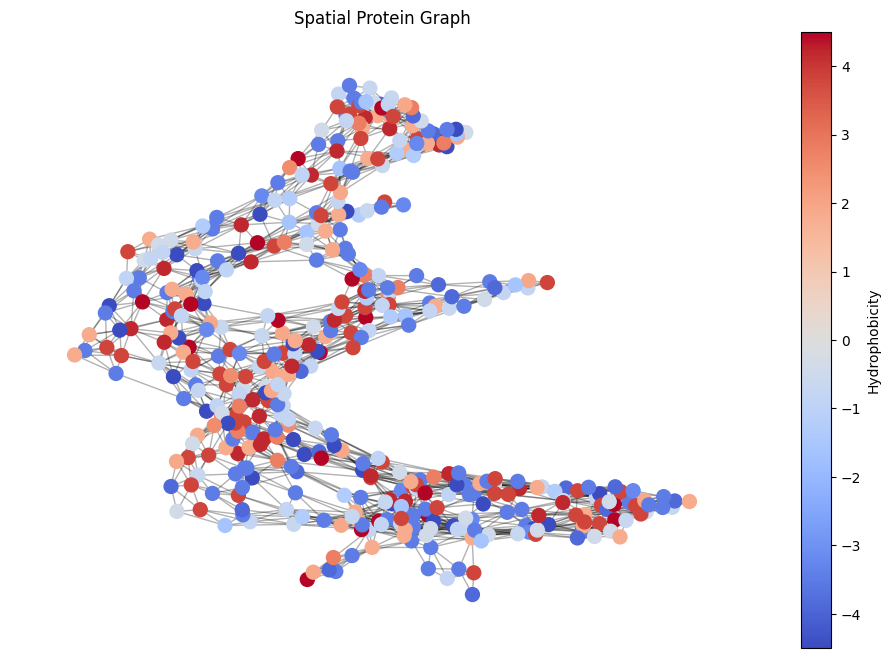

# ProtGraph

This project is meant as a starting point for exploring protein structures using graph-based representations.  
It could be extended for use in GNN models for structure prediction or classification.

ProtGraph is a simple tool that converts a protein sequence into a graph, where each node represents an amino acid and includes basic biochemical properties.  
The input is a PDB file, and the output is a graph with nodes enriched by numerical features like hydrophobicity, molecular weight, and net charge at pH 7.

## What it does

1. Reads a PDB file and extracts the sequence from a specified chain (default: A)  
2. Gets the Cα (alpha carbon) coordinates for each residue  
3. Calculates pairwise distances between residues  
4. Adds an edge between two nodes if the distance is below a given threshold (default: 8 Å)  
5. Assigns biochemical features to each node (loaded from a CSV file)  
6. Saves and visualizes the graph with node colors based on hydrophobicity

## Files

- `protgraph.ipynb` → main notebook  
- `data/1AOS.pdb` → sample PDB file  
- `data/amino_acid_properties.csv` → amino acid features  
- `protein_graph.graphml / .gpickle` → saved graph files  
- `graph.png` → image of the graph (colored by hydrophobicity)  
- `requirements.txt` → dependencies

## How to run

Install dependencies with:

```
pip install -r requirements.txt
```

Then open the notebook and run it step-by-step.  
Make sure your CSV and PDB file paths are correct.

## Output

- A graph object with nodes representing residues and edges based on spatial distance  
- Graph is saved in `.graphml` and `.gpickle` formats  
- Visualization image saved as `graph.png`



## Planned Extensions

- Support multiple chains in a single graph  
- Combine spatial edges with sequential (i → i+1) edges  
- Use contact maps instead of raw Cα distance  
- Export graphs in PyTorch Geometric format  


---

**This is a personal project to explore protein structure data using graphs.**  
If you have suggestions or feedback, feel free to open an issue or contact me.
